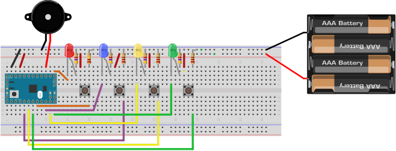

# memory-game

Memory Game presented in the Rapid Hardware Prototyping Workshop at
[Hack for Good Gulbenkian](http://hackforgood.pt)
2017

In June 2017
[LCD Porto](https://lcdporto.org)
was invited by Hack for Good to present a workshop about
prototyping hardware projects during the hackathon.

Hack for Good was organized by the Calouste Gulbenkian Foundation o foster the
development of technological solutions to real social challenges.

We decided to make a simple memory game that could be used in Alzheimer's
Disease Therapy.

After a quick search we found
[Arduino Simple Memory Game](https://www.instructables.com/id/Arduino-Simple-Memory-Game/)
by
[Rui Santos](https://www.instructables.com/member/RuiSantos/) and decided to
produce it as a marketable hardware prototype.

## The parts

### Software

Software was copied from the original project on Instructables.

### PCB - Printed Circuit Board

#### Breadboard

Before advancing with the design of the PCB we tested the circuit and software
using a Breadboard.

See the [breadboard directory](breadboard/).

### Box
